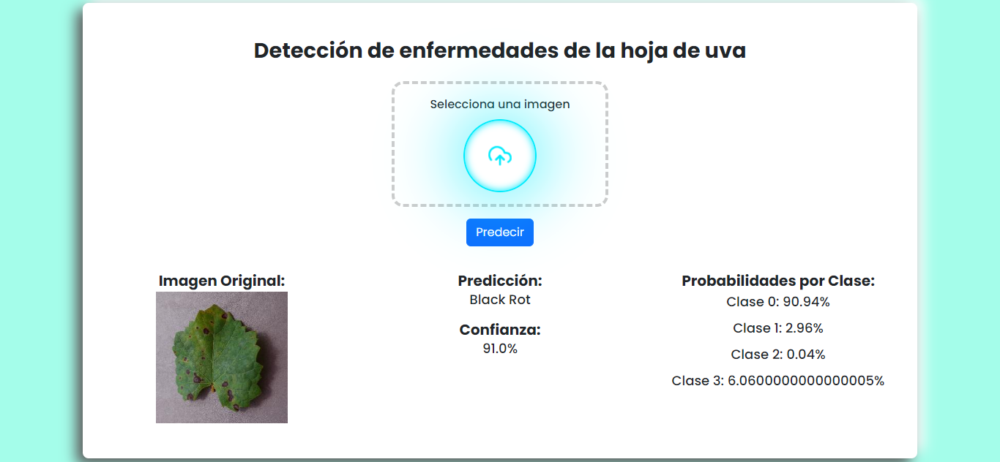

# Detección de Enfermedades en las Hojas de la Uva

Este es un proyecto de aplicación web utilizando Flask para cargar imágenes y mostrar resultados de un modelo de clasificación de imágenes. Las imágenes cargadas se almacenan en una base de datos PostgreSQL y el modelo de clasificación de imágenes se carga desde un archivo HDF5 (`mi_modelo.h5`).




## Prueba la Aplicación

Puedes probar la aplicación en vivo en el siguiente enlace:

[https://professional-kelci-ilanangelesrodriguez-b9f4f188.koyeb.app/](https://professional-kelci-ilanangelesrodriguez-b9f4f188.koyeb.app/)


## Estructura del Proyecto

El proyecto tiene la siguiente estructura de carpetas y archivos:

The project has the following folder and file structure:

```
page-deteccion-enfermedades-en-hojas-de-uva/
│
├── static/
│   ├── styles.css
│   └── script.js
│
├── uploads/
│   └── [uploaded images]
│
├── templates/
│   └── index.html
│
├── app.py
├── mi_modelo.h5
└── requirements.txt
```

## Requisitos

- Python 3.x
- Flask
- TensorFlow
- psycopg2
- PostgreSQL

## Instalación

1. Clona el repositorio:

```bash
git clone https://github.com/ilanangelesrodriguez/page-deteccion-enfermedades-en-hojas-de-uva
cd page-deteccion-enfermedades-en-hojas-de-uva
```

2. Crea y activa un entorno virtual:
```bash
python -m venv venv
source venv/bin/activate
```

3. Instala las dependencias:
```bash
pip install -r requirements.txt
```

4. Configura la base de datos PostgreSQL. Asegúrate de tener PostgreSQL instalado y crea una base de datos. Actualiza DATABASE_URL en app.py con la URL de tu base de datos.

5. Ejecuta la aplicación:
```bash
python app.py
```
La aplicación estará disponible en http://0.0.0.0:3200.

## Uso

1. Abre el navegador y ve a `http://0.0.0.0:3200`.
2. Sube una imagen utilizando el formulario de carga.
3. La imagen será procesada por el modelo de clasificación y se mostrará el resultado en la página principal junto con la confianza y las probabilidades de cada clase.

## Estructura del Código

### app.py

Este es el archivo principal de la aplicación Flask. Incluye las siguientes rutas:

- `/` - Muestra la página principal con el formulario de carga y los resultados de predicción.
- `/predict` - Procesa la imagen cargada, realiza la predicción y redirige a la página principal con los resultados.
- `/image/<int:image_id>` - Recupera una imagen de la base de datos y la muestra.

### templates/index.html

Este archivo contiene el HTML de la página principal. Incluye un formulario para cargar imágenes y muestra los resultados de la predicción.

### static/styles.css

Archivo de estilos CSS para la aplicación web.

### static/script.js

Archivo JavaScript para la funcionalidad del frontend.

## Desarrollo

El proyecto utiliza dos ramas: `main` y `develop`. Realiza tus cambios en la rama `develop` y realiza un pull request para fusionar en `main` cuando esté listo para producción.

## Contribuciones

Las contribuciones son bienvenidas. Por favor, sigue estos pasos:

1. Haz un fork del proyecto.
2. Crea una rama nueva (`git checkout -b feature/nueva-caracteristica`).
3. Realiza tus cambios y haz commit (`git commit -am 'Añadir nueva característica'`).
4. Haz push a la rama (`git push origin feature/nueva-caracteristica`).
5. Abre un pull request.

## Licencia

Este proyecto está bajo la Licencia MIT. Consulta el archivo [LICENSE](LICENSE) para más detalles.

## Desarrolladores

- Ángeles Rodríguez Ilan
- Loma Aguirre Mariesther
- Asesor: Daza Vergaray Alfredo

## Contacto

Para cualquier pregunta o sugerencia, por favor abre un issue en el repositorio o contacta a [ilanangelesrodriguez@gmail.com].
